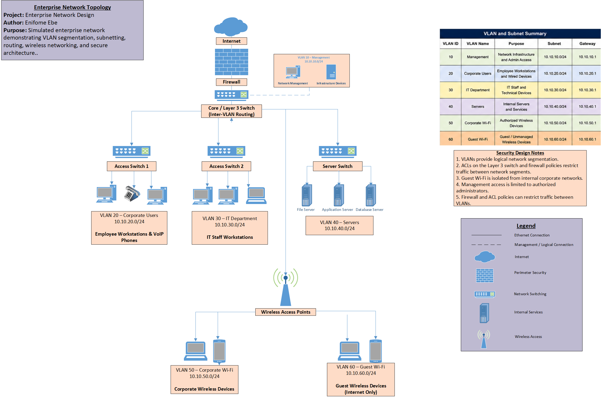

# 🌐 Enterprise Network Infrastructure Design

## 📌 Project Overview

This project demonstrates the design of a secure and scalable enterprise network infrastructure for a simulated organization. The network is designed to support multiple departments, employee devices, servers, wireless connectivity, and guest users while maintaining logical separation between different types of network traffic.

The project focuses on practical networking concepts including VLAN segmentation, subnetting, switching, routing, DHCP, DNS, wireless networking, and network security.

## Network Topology

The following diagram illustrates the logical architecture of the simulated enterprise network, including perimeter security, Layer 3 routing, access switching, server infrastructure, wireless connectivity, and VLAN segmentation.



## 🎯 Project Objectives

- Design a scalable enterprise network architecture
- Segment network traffic using VLANs
- Develop an organized IP addressing and subnetting scheme
- Separate employee, server, management, and guest traffic
- Configure inter-VLAN routing
- Provide DHCP and DNS services
- Incorporate secure wireless access
- Apply network security and access-control principles
- Document the network architecture and design decisions

## 🏢 Network Scenario

The simulated organization operates from a multi-department office environment and requires reliable wired and wireless connectivity.

The network supports:

- Corporate employees
- IT and network administrators
- Business departments
- Internal servers
- Corporate wireless devices
- Guest wireless users
- Network infrastructure and management devices

Different categories of users and devices are separated into VLANs to improve security, performance, and network management.

## 🛠️ Technologies & Concepts

**Networking**
- TCP/IP
- IPv4
- Subnetting
- VLANs
- 802.1Q Trunking
- Inter-VLAN Routing
- DHCP
- DNS
- Ethernet
- Wireless Networking

**Infrastructure**
- Router / Layer 3 Switching
- Access Switches
- Wireless Access Points
- Firewall
- MDF / IDF Architecture
- Cat6 Ethernet
- Fiber Backbone

**Security**
- Network Segmentation
- Guest Network Isolation
- Management VLAN
- Access Control
- Least-Privilege Network Design
- Firewall Policy Planning

**Documentation**
- Network Topology Diagrams
- IP Addressing Plans
- VLAN Documentation
- Infrastructure Documentation

## 🗂️ Repository Structure

```text
enterprise-network-design/
│
├── README.md
│
├── diagrams/
│   ├── network-topology.png
│   └── logical-network-design.png
│
├── documentation/
│   ├── network-design.md
│   └── security-considerations.md
│
├── addressing/
│   └── ip-addressing-plan.md
│
└── configs/
    └── example-configurations.md
